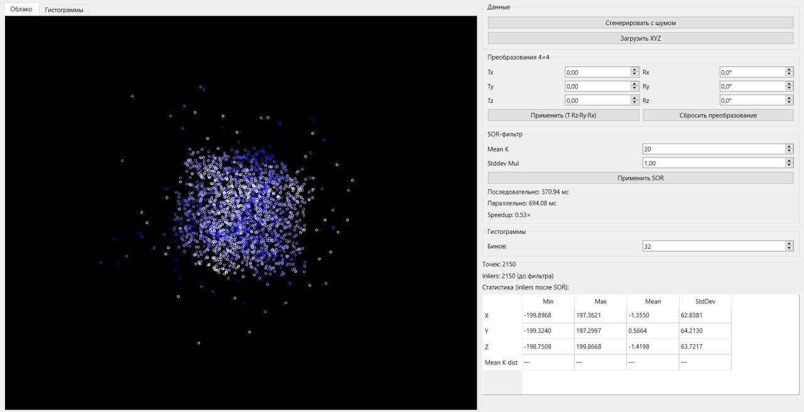
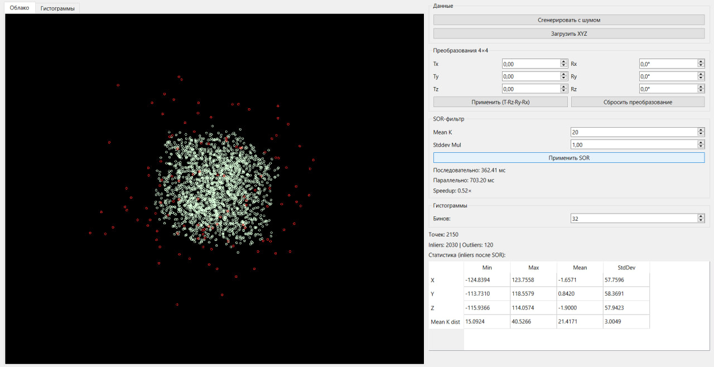
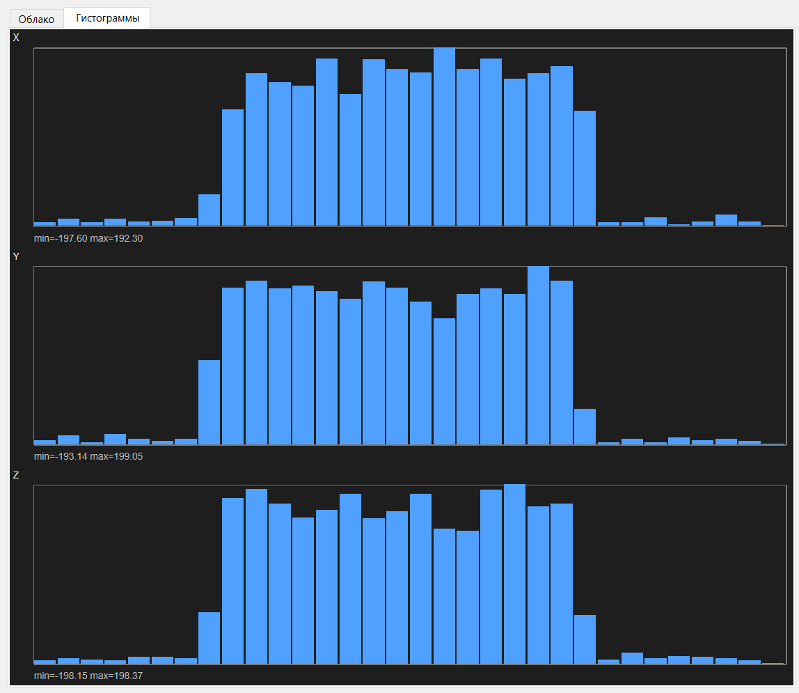

# Лабораторная работа №11 — Облако точек 

Qt-приложение для загрузки/генерации облака точек, преобразований матрицами 4×4, статистического анализа, гистограмм и SOR-фильтрации с сравнением последовательной и параллельной обработки.

### SOR (Statistical Outlier Removal)

1. Для каждой точки вычисляется среднее расстояние до **K** ближайших соседей.
2. По всем таким средним считаются глобальные **μ** и **σ**.
3. Порог: `τ = μ + k_σ · σ`. Точки с `meanDist > τ` помечаются как выбросы (`removed = true`).

### Параллелизация

- **Последовательно**: цикл по точкам.
- **Параллельно**: `std::async(std::launch::async)` для каждой точки.
- **Speedup** = `T_seq / T_par` (замер `std::chrono::steady_clock`).

### Статистика

По осям X, Y, Z и по массиву средних расстояний до соседей: min, max, среднее, σ. После SOR — только по **inliers** (не удалённым точкам).

## Сборка и запуск

### Требования

- Qt 6 (модуль Widgets) или Qt 5.15+
- Компилятор с поддержкой C++17 (MSVC, MinGW, GCC, Clang)

### Qt Creator

1. Открыть `lab.pro`
2. Выбрать kit (Desktop Qt)
3. Собрать и запустить

## Таблица Speedup

Замеры SOR: Mean K = 20, Stddev Mul = 1.0, тот же ПК.

| Точек (N) | T_seq (мс) | T_par (мс) | Speedup |
|-----------|------------|------------|---------|
| 2 150     |  370       |  690       | 0.53    |
| 5 000     | 2756       | 5134       | 0.46    |
| 10 750    | 9348       | 20613      | 0.45    |

**Speedup** = T_seq / T_par

## Скриншоты

